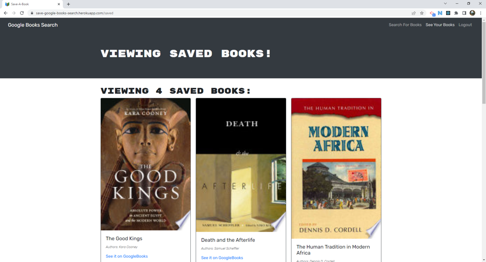

# Save-A-Book
## An application by H0RSESH0E  
&nbsp;  
  
&nbsp;&nbsp;  
## Table of Contents
#### [Description](#description)  -  [Installation](#installation)  -  [Usage](#usage) - [License](#license) - [Contributing](#contributing) - [Tests](#tests) - [Questions](#questions)
&nbsp;  
## Description  
This application was designed by the good folks at Triology Education Services and refactored to use a GraphQL Server and Client API by H0RSESH0E.  Delivering a private repository for your favourite Google Books, the functionality is simple and sweet.  
&nbsp;  
    
     
&nbsp;  
## Installation
To use the application, please access it on the web, at: 
## [Save-A-Book](https://save-google-books-search.herokuapp.com/)  
&nbsp;  
## Usage
N/A  
&nbsp;  
## License  

**GNU General Public License v3.0**  
Permissions of this strong copyleft license are conditioned on making available complete source code of licensed works and modifications, which include larger works using a licensed work, under the same license. Copyright and license notices must be   
[View the full license here.](./LICENSE/license.txt)  
&nbsp;  
## Contributing
N/A  
&nbsp;  
## Tests
N/A  
&nbsp;  
## Questions
Questions or concerns about the project or how to contribute to its development can be emailed to: **dcpb777@gmail.com**  
&nbsp;  
&nbsp;  
  
  
**[Visit me on GitHub](https://github.com/H0RSESH0E)**  
